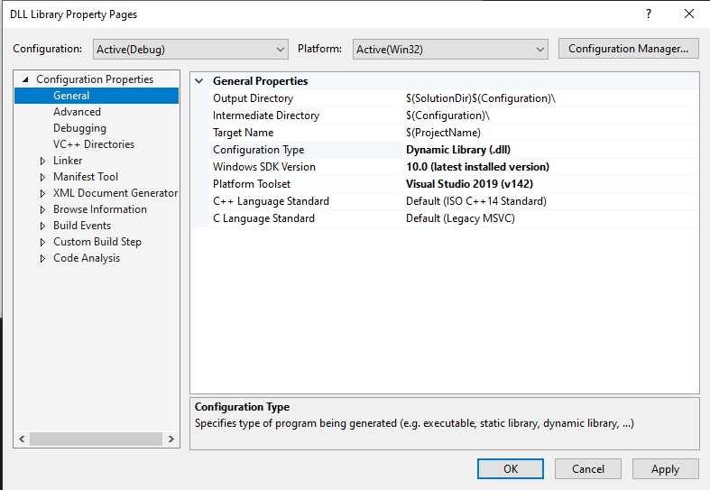
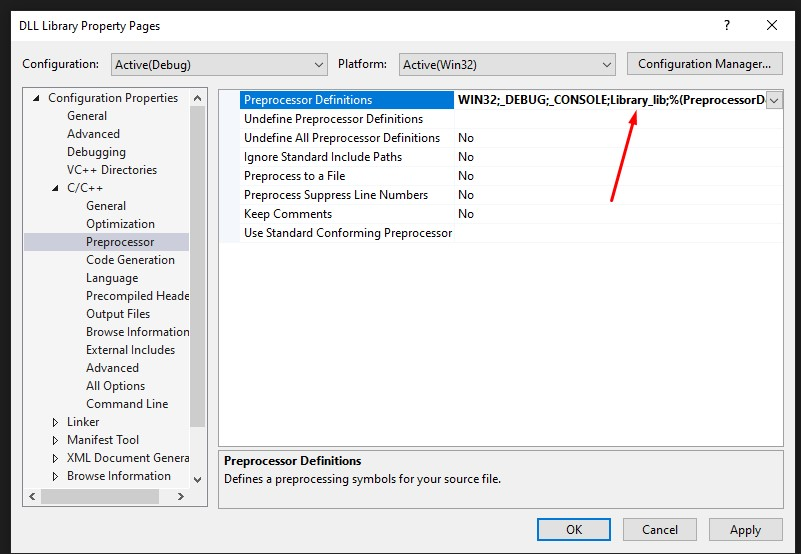

# DLL Example Project
## Author: Edward Patch | Date: 25/09/2021
**Why the selection?:** .NET C# is a great selection for the front-end. C++ is great for XML support and to compile language. This program is predicted to be string data intense, so this increases performance where ever possible. 
**Other Alternatives?:** ASP.NET and C++ *(This combination is great but I voted against it, as I can't seem to create a nice enough front-end. The front-end is going to be intense as it needs to remember IDs of multiple objects dragged within the software)*.

**What is DLL Import?:** DLL Import is a library available within C# that allows you to import library files. (https://docs.microsoft.com/en-us/dotnet/api/system.runtime.interopservices.dllimportattribute?view=net-5.0) 
**Why C++ and C# and not another mix?:** DLL Import and .NET Framework are new to me, and after researching, .NET Framework can end up being weighty in terms of performance. Also, DLL Libraries are all loaded at different stages during the process, rather than executed on real-time. This means that the logic could be bulky. 
**Screenshots of Setting up the Project:**

